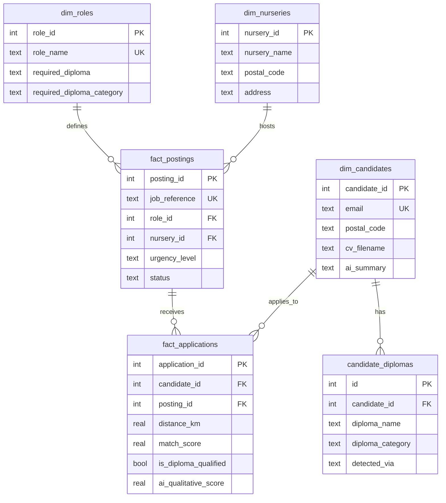

# BDD_GRANDIR System Documentation

## 📋 Executive Summary

**BDD_GRANDIR** (also known as "Grandir Central Command") is a recruitment platform designed to solve a critical scaling challenge for **Grandir (Les Chaperons Rouges)**, a French nursery network processing approximately **12,000 CVs per month**. The platform uses AI-powered matching to efficiently connect qualified candidates with urgent nursery positions across France.

### Current System Status
- **25 candidates** with AI-processed profiles
- **1,073 job postings** across **479 nurseries**
- **138 applications** tracked
- **29 diploma-qualified** candidate-job matches
- **28 CVs** processed using AI extraction

---

## 🎯 Business Context

### The Problem
Grandir faces a "leaky bucket" recruitment crisis:
- **Volume**: 12,000 CVs/month overwhelm manual processing
- **Qualification**: Must ensure candidates meet CAT 1/CAT 2 regulatory diploma requirements
- **Urgency**: Critical need to fill high-priority positions (Red/Orange urgency levels)
- **Geography**: Must match candidates to nearby nurseries they can commute to
- **Conversion**: Losing good candidates due to slow, generic processing

### The Solution
A multi-component platform that:
1. **Qualifies** candidates automatically using AI CV parsing and diploma matching
2. **Prioritizes** urgent positions (Red > Orange > Green)
3. **Matches** candidates to nearby nurseries using geolocation
4. **Scores** candidates using composite metrics (distance, urgency, compliance, AI quality)

---

## 🗄️ Database Architecture

### Schema Design: **Star Schema** (Data Warehouse Pattern)

The database follows a dimensional modeling approach with:
- **Dimension Tables**: Reference data (roles, nurseries, candidates)
- **Fact Tables**: Transactional data (postings, applications)
- **Bridge Table**: Many-to-many relationship (candidate_diplomas)

### Complete Table Structure

#### 1️⃣ `dim_roles` - Job Role Definitions
Stores standardized job titles and their diploma requirements.

**Columns:**
- `role_id` (PK, AUTO_INCREMENT) - Unique role identifier
- `role_name` (TEXT, UNIQUE, NOT NULL) - Job title (e.g., "Auxiliaire Petite Enfance H/F")
- `default_requirements` (TEXT) - Job description/requirements
- `required_diploma` (TEXT) - Short diploma code (e.g., "CAP", "EJE", "AP")
- `required_diploma_category` (TEXT) - Diploma category for matching
- `created_at`, `updated_at` (DATETIME) - Timestamps

**Current Data:** 19 roles

**Key Roles & Requirements:**
| Role | Required Diploma | Postings | Urgency |
|------|-----------------|----------|---------|
| Auxiliaire Petite Enfance H/F | CAP | 287 | High |
| Auxiliaire de Puériculture H/F | AP | 264 | High |
| Educateur de Jeunes Enfants H/F | EJE | 233 | High |
| Infirmier H/F | IDE | 78 | Medium |
| Directeur de Crèche H/F | EJE | 45 | Low |
| Agent de Service H/F | NONE | 40 | Variable |

---

#### 2️⃣ `dim_nurseries` - Nursery Locations
Contains all nursery (crèche) locations across France.

**Columns:**
- `nursery_id` (PK, AUTO_INCREMENT) - Unique nursery identifier
- `nursery_name` (TEXT, NOT NULL) - Nursery name
- `address` (TEXT) - Full street address
- `region` (TEXT) - Geographic region
- `director_region` (TEXT) - Management region
- `postal_code` (TEXT) - Postal code for geocoding
- `created_at`, `updated_at` (DATETIME) - Timestamps

**Current Data:** 479 nurseries across France

**Geolocation:**
- Coordinates extracted from `creche.kml` file (Google Maps export)
- Used for calculating candidate-nursery distances

---

#### 3️⃣ `dim_candidates` - Candidate Profiles
Stores candidate personal information and AI-enriched data.

**Columns:**
- `candidate_id` (PK, AUTO_INCREMENT) - Unique candidate identifier
- `first_name` (TEXT, NOT NULL) - Candidate first name
- `last_name` (TEXT, NOT NULL) - Candidate last name
- `email` (TEXT, UNIQUE, NOT NULL) - Email address (unique identifier)
- `phone` (TEXT) - Phone number
- `address` (TEXT) - Home address
- `postal_code` (TEXT) - Postal code for geocoding
- `cv_filename` (TEXT) - Associated CV file path
- `ai_summary` (TEXT) - AI-generated candidate summary
- `created_at`, `updated_at` (DATETIME) - Timestamps

**Indexes:**
- `idx_candidates_email` on `email` for fast lookups

**Current Data:** 25 candidates

**Data Sources:**
1. CSV import (`candidates_fresh.csv`)
2. AI extraction from PDF CVs (backfills missing data)

---

#### 4️⃣ `fact_postings` - Job Postings
Central fact table for open positions at nurseries.

**Columns:**
- `posting_id` (PK, AUTO_INCREMENT) - Unique posting identifier
- `job_reference` (TEXT, UNIQUE, NOT NULL) - Job reference code (e.g., "RAYWW395")
- `role_id` (FK → dim_roles) - Links to role definition
- `nursery_id` (FK → dim_nurseries) - Links to nursery location
- `status` (TEXT, CHECK) - 'Open' or 'Closed'
- `contract_type` (TEXT) - Contract type (CDI, CDD, etc.)
- `salary_min`, `salary_max` (REAL) - Salary range
- `open_date`, `close_date` (DATE) - Posting dates
- `urgency_level` (TEXT) - **CRITICAL**: 'Red', 'Orange', 'Green', or NULL
- `created_at`, `updated_at` (DATETIME) - Timestamps

**Indexes:**
- `idx_postings_status` on `status`
- `idx_postings_role` on `role_id`
- `idx_postings_nursery` on `nursery_id`
- `idx_postings_open_date` on `open_date`
- `idx_postings_job_reference` on `job_reference`

**Current Data:** 1,073 postings

**Urgency Distribution:**
- 🔴 **Red (Critical):** 427 postings (40%)
- 🟠 **Orange (High):** 165 postings (15%)
- 🟢 **Green (Normal):** 401 postings (37%)
- ⚪ **NULL:** 80 postings (7%)

**Business Logic:**
- Red/Orange positions must be filled FIRST
- Urgency affects candidate scoring (higher urgency = higher priority)

---

#### 5️⃣ `fact_applications` - Candidate Applications
Tracks all candidate applications to job postings with matching scores.

**Columns:**
- `application_id` (PK, AUTO_INCREMENT) - Unique application identifier
- `candidate_id` (FK → dim_candidates) - Links to candidate
- `posting_id` (FK → fact_postings) - Links to job posting
- `current_status` (TEXT) - Application status (e.g., "Candidature", "Refus", "Entretien")
- `current_stage` (TEXT) - Current pipeline stage
- `application_date` (DATE) - When candidate applied
- `last_update_date` (DATETIME) - Last status change
- `match_score` (REAL) - **Composite matching score (0-100)**
- `distance_km` (REAL) - Calculated distance between candidate and nursery
- `is_diploma_qualified` (BOOLEAN) - **Does candidate meet diploma requirements?**
- `ai_qualitative_score` (REAL) - AI-based quality assessment
- `notes` (TEXT) - Additional notes
- `created_at`, `updated_at` (DATETIME) - Timestamps

**Constraints:**
- UNIQUE constraint on (`candidate_id`, `posting_id`) - One application per candidate per job
- CASCADE delete when candidate or posting is deleted

**Indexes:**
- `idx_applications_candidate` on `candidate_id`
- `idx_applications_posting` on `posting_id`
- `idx_applications_status` on `current_status`
- `idx_applications_stage` on `current_stage`
- `idx_applications_date` on `application_date`

**Current Data:** 138 applications
- **29 diploma-qualified** matches (21%)
- **0 with distance calculations** (needs implementation)

---

#### 6️⃣ `candidate_diplomas` - Diploma Bridge Table
Many-to-many relationship: One candidate can have multiple diplomas.

**Columns:**
- `id` (PK, AUTO_INCREMENT) - Unique record identifier
- `candidate_id` (FK → dim_candidates) - Links to candidate
- `diploma_name` (TEXT) - Full diploma name (e.g., "CAP Accompagnant Educatif Petite Enfance")
- `diploma_category` (TEXT) - Standardized category: CAP, AP, EJE, PSY, IDE, PMO, OTHER, NONE
- `detected_via` (TEXT) - Source: "AI_CV_Extract", "CSV_Import", "Manual"
- `created_at` (DATETIME) - Timestamp

**Constraints:**
- CASCADE delete when candidate is deleted

**Current Data:** 34 diploma records across 25 candidates

**Diploma Categories:**
| Category | Description | Example Roles | Count |
|----------|-------------|---------------|-------|
| **CAP** | CAP AEPE, Bac ASSP, BEP | Auxiliaire Petite Enfance | 16 |
| **AP** | Auxiliaire de Puériculture | Auxiliaire de Puériculture | 0 |
| **EJE** | Educateur de Jeunes Enfants | EJE, Directeur de Crèche | 0 |
| **PSY** | Psychology degrees | Psychologue | 2 |
| **IDE** | Infirmier Diplômé d'État | Infirmier | 0 |
| **PMO** | Psychomotricien | Psychomotricien | 0 |
| **OTHER** | Non-qualifying diplomas | N/A | 16 |
| **NONE** | No relevant diploma | Agent de Service | 0 |

---

## 🧠 Business Logic & Algorithms

### 1. **Diploma Matching System**

#### Normalization Process
Raw diploma text from CVs → Standardized category

**Examples:**
- "CAP Accompagnant Educatif Petite Enfance" → **CAP**
- "Bac ASSP" → **CAP** (equivalent)
- "Auxiliaire de Puériculture" → **AP**
- "Educateur de Jeunes Enfants" → **EJE**
- "Licence en psychologie" → **PSY**
- "Baccalauréat scientifique" → **OTHER**

#### Matching Logic (Disjunctive Normal Form)
Each role has diploma requirements defined as:
- **AND/OR combinations** of acceptable diplomas
- Example: "Auxiliaire Petite Enfance" requires: `CAP OR AP OR EJE`
- Example: "Educateur de Jeunes Enfants" requires: `EJE`

#### Qualification Determination
```sql
is_diploma_qualified = 1 IF:
  candidate has ANY diploma in candidate_diplomas 
  WHERE diploma_category matches job's required_diploma_category
```

---

### 2. **Distance Calculation**

#### Geocoding Approach
1. **Nurseries:** GPS coordinates from `creche.kml` (Google Maps export)
2. **Candidates:** Postal code → GPS using `pgeocode` library
3. **Distance:** Haversine formula (great-circle distance)

#### Implementation Status
- ⚠️ **NOT YET POPULATED** (distance_km = NULL for all 138 applications)
- Previous conversations mentioned implementation attempts
- Required for accurate candidate scoring

---

### 3. **Master Grandir Score Formula**

The **composite match_score** combines multiple factors:

```
match_score = (Distance × 0.3) + (Urgency × 0.3) + (Compliance × 0.2) + (AI_Quality × 0.2)
```

**Components:**
1. **Distance (30%):** Proximity to nursery (closer = higher score)
2. **Urgency (30%):** Job urgency level (Red > Orange > Green)
3. **Compliance (20%):** Diploma qualification match (`is_diploma_qualified`)
4. **AI_Quality (20%):** AI-assessed candidate quality (`ai_qualitative_score`)

**Purpose:** Prioritize candidates who are:
- ✅ Nearby (can commute)
- ✅ Qualified (right diploma)
- ✅ For urgent positions (Red/Orange)
- ✅ High quality (AI assessment)

---

## 🤖 AI Integration

### AI-Powered Features

#### 1. **CV Parsing & Data Extraction**
- **Tool:** OpenAI API (GPT-based extraction)
- **Input:** PDF CVs from `export_cv (1)/` directory (28 files)
- **Extracts:**
  - Email, phone, address
  - Postal code (for geocoding)
  - Years of experience
  - List of diplomas (with standardization)
- **Output:** Backfills missing candidate data in `dim_candidates`

**Detection Source:** `detected_via = 'AI_CV_Extract'`

#### 2. **Candidate Summaries**
- **Field:** `dim_candidates.ai_summary`
- **Purpose:** Generate concise candidate profiles for recruiters
- **Status:** Column exists but may not be fully populated

#### 3. **AI Qualitative Scoring**
Referenced as "Grandir IQ" in previous conversations.

**Factors:**
- **Source Intelligence:** Application channel quality
- **Stability Signals:** Career consistency, experience
- **Process Velocity:** Response time, engagement

**Storage:** `fact_applications.ai_qualitative_score`

---

## 📂 Project Structure

```
BDD_GRANDIR/
├── grandir.db                      # SQLite database (426 KB)
├── creche.kml                      # Nursery GPS coordinates (549 KB)
├── export_cv (1)/                  # Candidate CVs (28 PDFs)
│   ├── 06d9e99b40abbeca567a485a79fa35f9.pdf
│   ├── CV-Adeline-COURAGEUX-2025.pdf.pdf
│   ├── cv-pauline-20250303.pdf
│   └── ... (25 more files)
├── unique_diplomas_list.txt       # All detected diploma variations (150 lines)
├── business_case.txt              # Project requirements
├── data_and_documentation.txt     # Data source documentation
├── requirements.txt               # Python dependencies
├── .env                           # API keys (OpenAI)
└── .gitignore                     # Git exclusions
```

**⚠️ Missing Files:**
- ❌ No Python application files (`app.py`, `ingest_v2.py`, etc.)
- ❌ No CSV files (`candidates_fresh.csv`, `jobs_fresh.csv`)
- ❌ Previous conversations mention these files existed

**Likely Scenario:** Files were deleted or moved after initial ingestion.

---

## 🔑 Key Insights

### Data Quality Issues
1. **Distance Data Missing:** 0/138 applications have `distance_km` populated
2. **Low Qualification Rate:** Only 29/138 (21%) applications are diploma-qualified
3. **Diploma Sparsity:** Many candidates lack qualifying diplomas (CAP/AP/EJE)

### Regulatory Compliance (CAT System)
French nursery regulations require specific diplomas:
- **CAT 1 Jobs:** Require state diplomas (CAP AEPE, AP, EJE)
- **CAT 2 Jobs:** Broader qualifications accepted
- **CAT 3 Jobs:** Support staff (no specific diploma)

### Urgency-Driven Prioritization
- **40% of postings are Red (critical)** - immediate filling required
- **15% are Orange (high priority)** - fill within weeks
- Platform must surface these first to recruiters

### Scalability Challenge
- Current: 25 candidates, 138 applications (manageable)
- Target: 12,000 CVs/month (requires full automation)
- System designed to handle scale via AI extraction and scoring

---

## 🛠️ Technical Stack (Inferred)

Based on conversation history and requirements:

### Backend
- **Python 3.x**
- **SQLite** (development database)
- **Libraries:**
  - `pgeocode` - Postal code geocoding
  - `openai` - AI CV parsing
  - `xml.etree` or similar - KML parsing
  - `sqlite3` - Database operations

### Frontend (Previous Implementation)
- **Streamlit** - Web dashboard for recruiters
- **streamlit-folium** - Interactive maps
- **Features:**
  - Command Center (KPIs, urgent postings)
  - Matching Engine (candidate ranking)
  - Candidate Database (searchable table)

### Data Processing
- **CSV Ingestion:** `candidates_fresh.csv`, `jobs_fresh.csv`
- **PDF Processing:** AI extraction from CVs
- **KML Parsing:** Google Maps nursery coordinates
- **Geolocation:** Haversine distance calculation

---

## 📊 Database Entity-Relationship Diagram



---

## 🎓 Diploma Standardization Reference

### Group A - Qualifying Diplomas (CAP Category)
**Accepted for Auxiliaire Petite Enfance positions:**
- CAP AEPE (Accompagnant Éducatif Petite Enfance)
- CAP Petite Enfance (old name)
- Bac ASSP (Accompagnement Soins et Services à la Personne)
- Bac Pro ASSP
- BEP Carrières Sanitaires & Sociales

### Group B - Specialized Diplomas
**Higher-level certifications:**
- **AP:** Auxiliaire de Puériculture
- **EJE:** Educateur de Jeunes Enfants (also required for Director roles)
- **IDE:** Infirmier Diplômé d'État
- **PSY:** Psychologue (Psychology degrees)
- **PMO:** Psychomotricien

### Group C - Non-Qualifying
**OTHER category:**
- General Baccalauréat (scientific, literary)
- University degrees (unless PSY)
- Other professional certifications

---

## 📈 Current System Metrics

### Candidate Pool
- **Total Candidates:** 25
- **With CVs Processed:** 28 files (some duplicates possible)
- **With AI-Extracted Diplomas:** 25
- **Average Diplomas per Candidate:** 1.36

### Job Market
- **Total Postings:** 1,073
- **Open Positions:** 1,073 (100%)
- **Critical (Red):** 427 (40%)
- **High Priority (Orange):** 165 (15%)

### Applications
- **Total Applications:** 138
- **Diploma Qualified:** 29 (21%)
- **With Distance Data:** 0 (0%) ⚠️
- **With Match Scores:** TBD (likely incomplete)

### Nursery Network
- **Total Nurseries:** 479 across France
- **With GPS Coordinates:** 479 (from KML file)
- **Geographic Coverage:** National

---

## 🚀 Next Steps & Recommendations

### Critical Missing Components
1. ✅ **Distance Calculation Implementation**
   - Parse candidate postal codes
   - Geocode using pgeocode
   - Calculate Haversine distances
   - Populate `fact_applications.distance_km`

2. ✅ **Match Score Calculation**
   - Implement composite scoring formula
   - Populate `fact_applications.match_score`
   - Enable candidate ranking

3. ✅ **Rebuild Application Layer**
   - Recreate Streamlit dashboard
   - Implement matching engine UI
   - Add candidate search/filter

### Data Quality Improvements
1. Increase diploma qualification rate (currently 21%)
2. AI summary generation for all candidates
3. Validate and clean postal codes

### Scalability Readiness
1. Test with larger candidate volumes
2. Optimize database indexes
3. Consider PostgreSQL migration for production
4. Implement caching for distance calculations

---

## 📝 Glossary

| Term | Definition |
|------|------------|
| **CAT 1/2/3** | French regulatory categories for nursery positions based on required diplomas |
| **Grandir** | Les Chaperons Rouges, French nursery network with ~479 locations |
| **Urgency Level** | Red (critical), Orange (high), Green (normal) priority for filling positions |
| **KML** | Keyhole Markup Language - Google Maps export format with GPS coordinates |
| **Haversine** | Formula for calculating great-circle distance between two GPS points |
| **DNF** | Disjunctive Normal Form - AND/OR logic for diploma matching |
| **Grandir IQ** | AI-based qualitative scoring system for candidate assessment |

---

## 📞 Contact & Support

**Project Owner:** Milo  
**Database:** `/Users/milo/Desktop/BDD_GRANDIR/grandir.db`  
**Last Updated:** December 2025

---

*This documentation represents the complete system as of the time of analysis. For questions about implementation details or to request updates, please contact the project team.*
